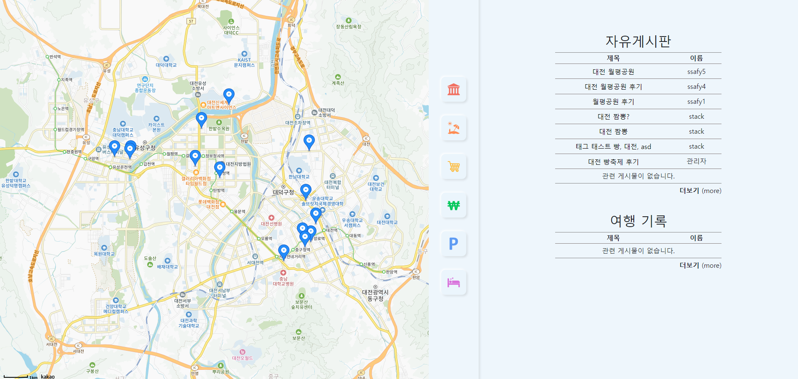
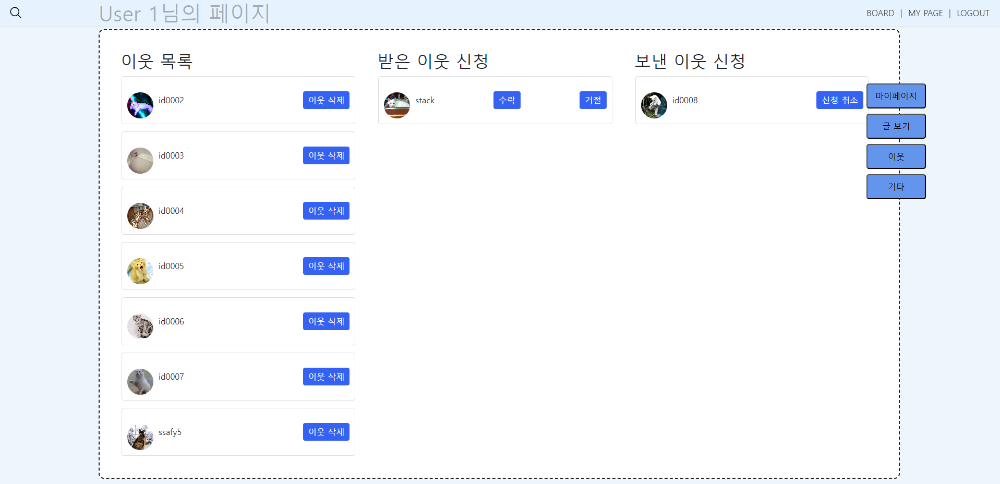

# 이리가리 프로젝트

본 프로젝트는 사용자들이 여행기록을 기록하고 공유할 수 있는 웹 어플리케이션입니다. 사용자들이 싸이월드와 같이 개인 미니홈피를 통해 여행게시물을 관리할 수 있으며 이웃 신청으로 다른 사용자와 게시물을 공유할 수 있습니다. 그리고 검색 시스템을 통해 여행 게시물과 관련 여행지를 한번에 검색함으로써 사용자의 편의성을 높여주는 시스템입니다.
<br/><br/>

## Recommended IDE Setup

[VSCode](https://code.visualstudio.com/) + [Volar](https://marketplace.visualstudio.com/items?itemName=Vue.volar) (and disable Vetur) + [TypeScript Vue Plugin (Volar)](https://marketplace.visualstudio.com/items?itemName=Vue.vscode-typescript-vue-plugin).

## Customize configuration

See [Vite Configuration Reference](https://vitejs.dev/config/).

## Project Setup

```sh
npm install
```

### Compile and Hot-Reload for Development

```sh
npm run dev
```

### Compile and Minify for Production

```sh
npm run build
```


## 화면 안내
1. 메인 화면 : 아래 사진은 처음 웹 사이트 접속 시 보이는 화면으로 상단 바를 통해 검색과 로그인, 회원가입, 로그인 시 마이 페이지로 이동할 수 있습니다.
<br/><br/>

2. 인기 검색어 페이지 : 메인 화면에서 스크롤 시 아래에 보이는 화면으로 검색어가 많은 순서대로 큰 원을 가지고 있습니다. 각 원을 클릭 시 해당 검색어로 검색이 되어 통합 검색 페이지로 이동합니다.<br/><br/>

3. 통합 검색 페이지 : 키워드 검색 시 카카오맵 검색 API를 통해 관련 장소가 표출됩니다. 그리고 해당 키워드와 관련된 해시태그를 가진 게시물이 검색됩니다. 또한 검색된 장소 중심으로 편의시설을 검색할 수 있는 기능이 있습니다.
<br/><br/>

4. 게시판 페이지 : 게시판 페이지로 자유게시판과 여행 기록 게시판을 한 페이지에서 볼 수 있습니다. 
<br/><br/>

5. 자유게시판 상세 페이지 : 자유게시판에서 게시물 클릭 시 보이는 페이지입니다.
<br/><br/>

6. 자유게시판 작성 페이지 : 자유게시판에서 글 작성 시 보이는 페이지입니다.
<br/><br/>

7. 여행 기록 상세 페이지 : 여행 기록에서 게시물 클릭 시 보이는 페이지입니다. 여행지 카드와 여행 경로를 나타내는 화면단입니다.
<br/><br/>

8. 여행 기록 작성 페이지 : 여행 기록에서 글 작성 시 보이는 페이지입니다. 원하는 장소를 검색하고 해당 장소를 여행 카드에 기록하여 여행 경로를 추가할 수 있습니다.
<br/><br/>

9. 마이페이지 : 마이페이지 접속 시 보이는 첫 화면입니다. 이웃 목록과 이웃의 새 글을 조회할 수 있습니다.
<br/><br/>

10. 마이페이지 내 게시글 페이지 : 마이페이지에서 글 보기 클릭 시 보이는 화면입니다. 사용자가 작성한 글을 조회할 수 있습니다.
<br/><br/>

11. 마이페이지 내 이웃 페이지 : 마이페이지에서 이웃 클릭 시 보이는 화면입니다. 사용자의 이웃과 이웃 신청 현황을 조회할 수 있습니다.
<br/><br/>

12. 로그인 및 회원가입 페이지
<br/><br/>
<br/><br/>
<br/>
<br/><br/>

